# README3.md
# Лабораторная работа №3: Разработка синтаксического анализатора (парсера)

## Название и цель лабораторной работы

**Название:** Разработка синтаксического анализатора (парсера) для объявлений перечислений на языке Haskell

**Цель работы:** Изучить назначение и принципы работы синтаксического анализатора в структуре компилятора. Спроектировать грамматику, построить соответствующую схему метода анализа грамматики и выполнить программную реализацию парсера с нейтрализацией синтаксических ошибок методом Айронса. Интегрировать разработанный модуль в ранее созданный графический интерфейс языкового процессора.

---

## Сведения об авторе

| Поле | Значение |
|------|----------|
| **ФИО** | Еловикова.К.С. |
| **Группа** | АВТ-313 |
| **Дисциплина** | Теория формальных языков и компиляторов |
| **Лабораторная работа** | №3 |
| **Вариант** | 69 (Распознавание объявлений перечислений на языке Haskell) |

---

## Постановка задачи

Разработать синтаксический анализатор (парсер) для распознавания объявлений перечислений на языке Haskell формата:
```haskell
data Day = Monday | Tuesday | Wednesday
```
### Примеры корректных входных строк

**Пример 1:**
```haskell
data Day = Monday | Tuesday | Wednesday
```
**Пример 2:**
```haskell
data Color = Red | Green | Blue
```
**Пример 3:**
```haskeil
data Bool = True | False
```
**Перечень допустимых лексем**

| Код | Тип лексемы | Описание | Пример |
|-----|-------------|----------|--------|
| 1 | KEYWORD_DATA | Ключевое слово data | `data` |
| 2 | IDENTIFIER_TYPE | Имя типа (с заглавной буквы) | `Day`, `Color` |
| 3 | IDENTIFIER_CONSTRUCTOR | Имя конструктора (с заглавной буквы) | `Monday`, `Red` |
| 4 | EQUALS | Знак равенства | `=` |
| 5 | PIPE | Разделитель | `\|` |
| 6 | SEMICOLON | Точка с запятой | `;` |
| 7 | COMMENT | Комментарий | `-- текст` |
| 99 | ERROR | Ошибочный символ | любой другой символ |

## Разработка грамматики
# Формальное описание грамматики G[PROGRAM]

Определим грамматику для распознавания объявлений перечислений на языке Haskell в нотации Хомского.

**Составляющие грамматики:**

Z = PROGRAM (начальный символ)

V_T = {'data', 'IDENTIFIER', '=', '|', ';', '--', 'COMMENT'}

V_N = {PROGRAM, DECLARATION, DATA, TYPE, EQUALS, CONSTRUCTORS, CONSTRUCTOR, 
       DECLARATION_LIST, CONSTRUCTOR_LIST}

P = {
    1.  PROGRAM → DECLARATION_LIST
    2.  DECLARATION_LIST → DECLARATION
    3.  DECLARATION_LIST → DECLARATION ';' DECLARATION_LIST
    4.  DECLARATION → DATA TYPE EQUALS CONSTRUCTORS
    5.  DATA → 'data'
    6.  TYPE → IDENTIFIER (с заглавной буквы)
    7.  EQUALS → '='
    8.  CONSTRUCTORS → CONSTRUCTOR
    9.  CONSTRUCTORS → CONSTRUCTOR '|' CONSTRUCTORS
    10. CONSTRUCTOR → IDENTIFIER (с заглавной буквы)
}

**Грамматика в расширенной форме Бэкуса-Наура (РБНФ)**

Для удобства реализации представим грамматику в форме РБНФ:

PROGRAM        → DECLARATION { ';' DECLARATION }
DECLARATION    → DATA TYPE EQUALS CONSTRUCTORS
DATA           → 'data'
TYPE           → IDENTIFIER (начинается с заглавной буквы)
EQUALS         → '='
CONSTRUCTORS   → CONSTRUCTOR { '|' CONSTRUCTOR }
CONSTRUCTOR    → IDENTIFIER (начинается с заглавной буквы)

## Классификация грамматики (по Хомскому)
**Тип грамматики**
Данная грамматика относится к контекстно-свободной грамматике (КС-грамматике, тип 2) по классификации Хомского.

**Обоснование**
**1.Левая часть продукций** содержит только один нетерминальный символ:

PROGRAM → DECLARATION_LIST

DECLARATION → DATA TYPE EQUALS CONSTRUCTORS

DATA → 'data'

TYPE → IDENTIFIER

**2.Правая часть продукций** может содержать как терминальные, так и нетерминальные символы в любых комбинациях.

**3.Отсутствие контекстной зависимости** — применение правил не зависит от окружения нетерминала.

**4.Проверка на LL(1)-свойства:**

Отсутствие левой рекурсии

Левая факторизация не требуется

FIRST и FOLLOW множества не пересекаются

### FIRST и FOLLOW множества

| Нетерминал | FIRST множество | FOLLOW множество |
|------------|-----------------|------------------|
| PROGRAM | {`data`} | {`$`} |
| DECLARATION | {`data`} | {`;`, `$`} |
| DATA | {`data`} | {`IDENTIFIER`} |
| TYPE | {`IDENTIFIER` (заглавный)} | {`=`} |
| EQUALS | {`=`} | {`IDENTIFIER` (заглавный)} |
| CONSTRUCTORS | {`IDENTIFIER` (заглавный)} | {`;`, `$`} |
| CONSTRUCTOR | {`IDENTIFIER` (заглавный)} | {`\|`, `;`, `$`} |

## Метод анализа

### Выбранный метод: рекурсивный спуск

| Характеристика | Описание |
|----------------|----------|
| Простота реализации | Каждому нетерминалу соответствует одна функция |
| Наглядность кода | Структура функций повторяет структуру грамматики |
| Гибкость | Легко добавлять обработку ошибок |
| Контроль | Полный контроль над процессом разбора |

## Схема метода анализа (рекурсивный спуск)

### Псевдокод функций

```mermaid
graph TD
    START --> PROGRAM
    
    subgraph PROGRAM [Функция PROGRAM]
        P1[Вызвать DECLARATION] --> P2{Есть еще токены?}
        P2 -->|Да| P3{Токен ';'?}
        P3 -->|Да| P4[Потребить ';']
        P4 --> P1
        P3 -->|Нет| P5[ОШИБКА: ожидался ';']
        P5 --> P6[Пропуск до ';' или 'data']
        P6 --> P1
        P2 -->|Нет| P_END
    end
    
    PROGRAM --> DECLARATION
    
    subgraph DECLARATION [Функция DECLARATION]
        D1{Токен 'data'?} -->|Да| D2[Потребить 'data']
        D1 -->|Нет| D3[ОШИБКА: ожидалось 'data']
        D3 --> D4[Пропуск до 'data']
        D4 --> D_END
        D2 --> D5[Вызвать TYPE]
        D5 --> D6{Токен '='?}
        D6 -->|Да| D7[Потребить '=']
        D6 -->|Нет| D8[ОШИБКА: ожидался '=']
        D8 --> D9[Пропуск до '=']
        D9 --> D10[Вызвать CONSTRUCTORS]
        D7 --> D10
        D10 --> D_END
    end
    
    DECLARATION --> TYPE
    DECLARATION --> CONSTRUCTORS

    subgraph TYPE [Функция TYPE]
        T1{Токен IDENTIFIER<br>с заглавной буквы?} -->|Да| T2[Добавить в таблицу символов]
        T2 --> T3[Потребить токен]
        T3 --> T_END
        T1 -->|Нет| T4[ОШИБКА]
        T4 --> T_END
    end
    
    subgraph CONSTRUCTORS [Функция CONSTRUCTORS]
        C1[Вызвать CONSTRUCTOR] --> C2{Токен '&#124;'?}
        C2 -->|Да| C3[Потребить '&#124;']
        C3 --> C1
        C2 -->|Нет| C_END
    end
    
    subgraph CONSTRUCTOR [Функция CONSTRUCTOR]
        CR1{Токен IDENTIFIER<br>с заглавной буквы?} -->|Да| CR2[Добавить в таблицу символов]
        CR2 --> CR3[Потребить токен]
        CR3 --> CR_END
        CR1 -->|Нет| CR4[ОШИБКА]
        CR4 --> CR_END
    end
    
    PROGRAM --> END
```



